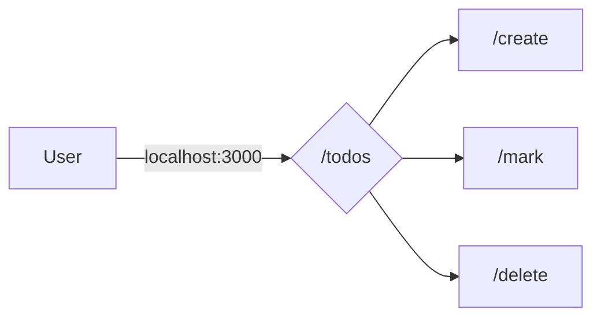

# Full-Stack Todos APP
> I love todo apps , one of my favourite is google tasks . So though od designing one myself .
- **Frontend** - React

- **Backend**- express, jwt, zod , nodejs ,monogo

  

## Functions

- Different routes for

- /todos/create 
- /todos/delete 
- /todos/mark - marks as completed
- /todos/ - view all todos

## Flow chart 
<!-- Can change this flow chart to sequece diagram by changing graph LR to  sequenceDiagram  learn more about it in -->
[ Learn more about sequenceDiagram](https://stackedit.io/app)

# Images

